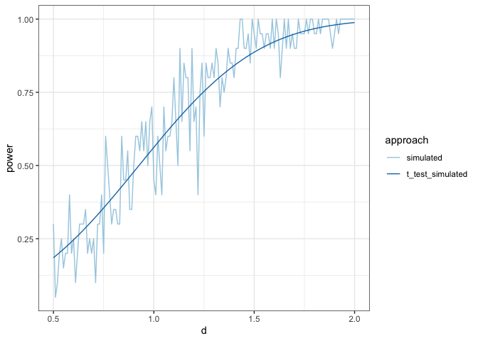
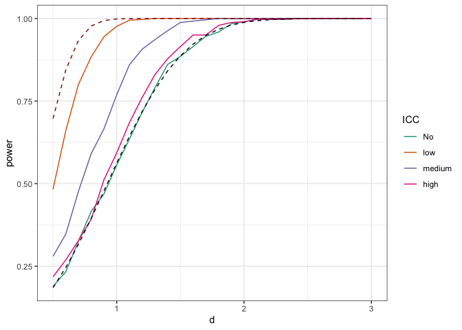

<!-- README.md is generated from README.Rmd. Please edit that file -->

# gutsandcages

The goal of `gutsandcages` is to estimate statistical power for
microbiome experiments in mice and rats.

## Installation

You can install the development version with:

``` r
# install.packages("devtools")
devtools::install_github("PennChopMicrobiomeProgram/gutsandcages")
```

## Example

``` r
library(tidyverse)
library(pwr)
library(ggplot2)
library(gutsandcages)
library(future)
```

The `gutsandcages` library computes statistical power by simulation. For
a given experimental design and effect size, our goal is to estimate the
fraction of trials in which the null hypothesis will be rejected.

To demonstrate use of the package, we’ll run simulations on a very
simple experimental design, one that we might encounter in statistics
101. Then, we’ll compare the result from our simulations with the
textbook formula for a t-test.

In our simple experiment, we have 10 mice in each group, one per cage.
Here’s the textbook formula for statistical power, as implemented in the
`pwr` library. The effect size, *d*, is the difference in means between
the two groups divided by the standard deviation (which we assume to be
the same in both groups).

``` r
textbook_power <- tibble(d = seq(0.5, 2, by = 0.01)) %>%
  group_by(d) %>%
  mutate(power = pwr.t.test(n = 10, d = d)$power)
```

In `gutsandcages`, we first specify the experimental design.

``` r
expt <- make_expt(ncage_treatment = 10, mice_per_cage_treatment = 1)
```

Then, we use this object to run simulations at each value of the effect
size in two steps. First, we get the overall test result in a tibble
using `get_test_res`, and then use `get_power` function to calculate the
power.

We use a small number of simulations to make the computation more speedy
and to give you a feel for the uncertainty in computing statistical
power by
simulation.

``` r
simulated_power <- get_power(expt, d = seq(0.5, 2, by = 0.01), p = 0, nsim = 20)
```

``` r
simulated_power %>%
  pivot_longer(names_to = "approach", values_to = "power", cols = -d) %>%
    mutate(approach = str_replace(approach,"power", "simulated")) %>%
    mutate(approach = str_replace(approach, "t_test_power", "textbook")) %>%
  
  ggplot(aes(x = d, y = power, color = approach)) +
  geom_line() +
  scale_color_brewer(palette = "Paired") +
  theme_bw()
```

<!-- -->

Because simulation takes long time, `get_power` also implement features
that you could run this in parallel on your local computer. Here is an
example:

``` r
library(future)
plan(multisession) 
 sim_test<- get_power(expt,d = seq(0.5, 2, by = 0.01), p = 0, nsim = 200)
```

For mouse experiment, it is common for mice to share a cage. The gut
microbiome of the mice that share the same cage are affected by each
other. In linear mixed model, we call it random effect. Therefore, when
we have more than one mice per cage, we used a linear mixed model to
account for the random effect of the cage. when you specify your
experimental design, make sure to specify number of cages if you have
shared cages.

The function `get_power` will gather the information and use a linear
mixed model instead a linear model to calculate the power. Also it is
important for the model to know how much cage affected gut microbiome,
we specify the propotion of the randome effect with p, which is also
referred as intraclass correlation coefficient, more details here
<https://bookdown.org/anshul302/HE902-MGHIHP-Spring2020/Random.html#ICCintro>

When you have one mouse per cage, p = 0, when you have multiple mice per
cage, p is within the range of 0 to 1. it is the proportion of the
effect on cage.

``` r
expt2 <- make_expt(ncage_treatment  = 10, mice_per_cage_treatment = 3)
power <- get_power(expt2, seq(0.2, 3, by= 0.4), p = c(0.6,0.9), nsim = 20)
```

Let’s look at how different ICC affect the power. Compare different ICC,
from low to high (0.1, 0.5, 0.9) Black dashed line is reference power
from t test ncage = 10, and red dashed line is t test ncage = 50

``` r
expt_icc <- make_expt(ncage_treatment = 10, mice_per_cage_treatment = 5)
plan(multisession) 
icc_r <- get_power(expt_icc, seq(0.5, 3, by = 0.1), c(0.1, 0.5, 0.9), nsim = 1000) %>%
  mutate(ICC = paste0(rep(c("low","medium", "high"), time = n()/3))) %>%
  select(-t_test_power)

no_icc_r <- get_power(make_expt(ncage_treatment = 10, mice_per_cage_treatment = 1), seq(0.5, 3, by = 0.1), p = 0, nsim = 1000) %>%
  mutate(p = 0) %>%
  mutate(ICC = "No")

no_icc_r_m <- no_icc_r %>% select(-t_test_power)

no_icc_50 <- get_power(make_expt(ncage_treatment = 50, mice_per_cage_treatment = 1), seq(0.5, 3, by = 0.1), p = 0, nsim = 1000) %>%
  rename(t_test_power2 = t_test_power)

rbind(icc_r, no_icc_r_m) %>%
  mutate(ICC = factor(ICC, levels = c("No","low","medium", "high"))) %>%
  left_join(no_icc_r %>% select(d, t_test_power), by = "d") %>%
  left_join(no_icc_50 %>% select(d, t_test_power2), by = "d") %>%

  ggplot(aes(x = d, y = power, color = ICC)) +
   geom_line() +
  scale_color_brewer(palette = "Dark2") +
  theme_bw() +
   geom_line(aes(y=t_test_power), linetype = "dashed", color = "black") +
  geom_line(aes(y=t_test_power2), linetype = "dashed", color = "darkred")
```

<!-- -->
